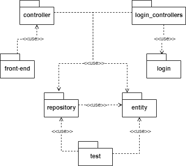

# Trabajo Final - Arquitecturas Web - TUDAI - 2020
## Honores, Manuel - Leonardo, Molleker - Gosende, Manuel.

## _Create Data_
[link a repositorio donde se encuentra el proyecto para generar datos de prueba.](https://github.com/ManuelHonores/CreateData-ArquitecturaTPFinal)

## _Agenda de Viajes_
Como primer paso, se analizó en profundidad el enunciado para poder identificar las entidades necesarias para resolver el trabajo práctico.
Posteriormente, se comenzaron a diagramar las vistas y tablas para poder tener una estructura de nuestro sistema. A Continuación, detallaremos cada una de ellas:

### Diagrama de entidades y relaciones

En el proceso de análisis antes comentado, se detectó que un Plan puede ser de tres maneras diferentes:
- Una reserva de hotel, que puede realizarse mediante un formulario o subiendo un archivo de texto.
- Un vuelo, que contará con varios items adicionales a la hora de mostrarse.
- Y una excursión, como punto general para cualquier otra actividad que se realice en un viaje.

### Vista de módulos

Con el diagrama de clases se muestra cómo se relacionan cada una de las entidades que componen nuestro sistema:

La capa de módulos se divide como se ve en la siguiente imagen:

- front-end: Cuenta con los archivos html, css y javascript. Se conecta con el controller para realizar consultas a la API.
- controllers: Aquí se encuentran los controladores de cada entidad. Reciben las consultas, las procesan y las devuelven.
- repositories: Cada entidad cuenta con su repositorio, el cual realiza la consulta a la base de datos, y le devuelve información a los controllers correspondientes.
- entities: Cada objeto que interfiere en nuestro sistema.
- test: Realiza las inserciones para poder comprobar el correcto funcionamiento de nuestra aplicación.
- login_controllers: Cuenta con una clase Login encargada de rutear las sesiones de usuario.
- login: Realiza las configuraciones de JWT, autorizaciones y Swagger.

### Vista de C&C

El despliegue del sistema se realiza en un mismo contenedor (monolito). Por su parte los clientes serán independientes, y cuando realicen peticiones, sólo se consultará una base de datos.
Para mostrar el funcionamiento de nuestro sistema,  se diagramó la siguiente vista:

1. Como primer paso, el cliente realiza una petición REST a través de un ENDPOINT.
2. Dicha petición es recibida y procesada por un Controller dependiendo de qué entidad esté relacionada con la consulta.
3. Una vez procesada, el fitro de login a través de una clave token, le permitirá realizar o no la petición.
4. En caso de permitirse dicha petición, el Controller de la entidad va a utilizar su respectivo repositorio para acceder a los datos.
5. Luego de obtener los datos, se devuelve un JSON con los datos solicitados.

### Diagrama de secuencia

Para ejemplificar un pequeño funcionamiento de nuestro sistema, se muestra a continuación la carga de un viaje. Vale aclarar, que una vez que el usuario cargó su viaje, podrá icorporarle planes al mismo.

